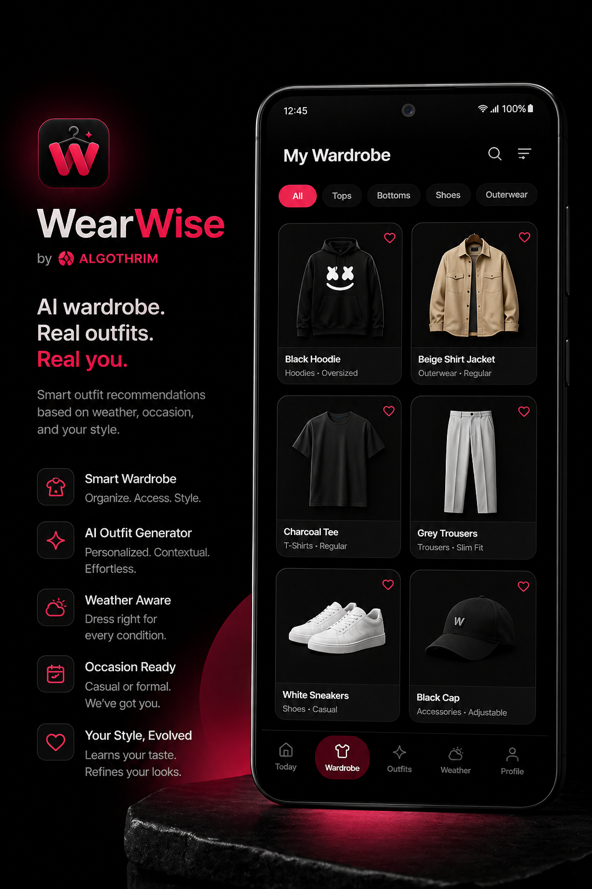

<div align="center">

# WearWise

### *Dress like you already know what you're doing.*

[](https://wearwise-by-algothrim.vercel.app)
[](https://nextjs.org)
[](https://www.typescriptlang.org)
[](https://supabase.com)
[](https://wearwise-by-algothrim.vercel.app)
[](https://github.com/TheAlgo7/wearwise-by-algothrim)

</div>

<p align="center">
  
</p>

## Why This Exists

Most AI apps are built around a generic user persona. WearWise was built around one real person: Gaurav Kumar, standing in front of his wardrobe at 7 AM, needing an answer — not options, not inspiration, not a mood board. An answer.

That constraint is the whole product. It forces every decision to be concrete: which clothes he actually owns, what the weather is right now, where he is going today, what his body proportions need, what he has already worn this week. The AI does not guess at a persona. It works from a real wardrobe, a real style blueprint, and a real context — or it does not run.

**This repo is a public case study in bespoke AI software.** The point is not "sign up and manage your wardrobe." The point is: look what happens when software is built around one real life instead of a hypothetical average user. Want something like this built for you? [Get in touch.](https://thealgothrim.com)

## How The Engine Works

**Stage 1 — The Bouncer**
Filters the wardrobe by temperature, formality, vibe, and recency before any model sees the candidate set.

**Stage 2 — The Stylist**
Builds 2–3 complete outfits with reasoning using a multi-provider pipeline and a private style blueprint.

The LLM is the last mile, not the whole pipeline. The filtering, scoring, and context assembly happen in code — so the model gets a tight, relevant candidate set instead of a raw wardrobe dump.

## Features

- **AI outfit generation** tuned to your actual wardrobe instead of a generic catalog.
- **Photo-to-closet flow** with background cleanup and AI-assisted tagging.
- **Modes and timing controls** for Church, Travel, Impress, tonight, tomorrow, and more.
- **Weather-aware suggestions** with location-sensitive output.
- **Outfit history** so the system remembers what has already been worn.
- **Personal style blueprint** injected into generation so the voice stays yours.

## Install to Home Screen

**Android (Chrome):**
1. Open [wearwise-by-algothrim.vercel.app](https://wearwise-by-algothrim.vercel.app) in Chrome
2. Tap the **⋮** menu → **Add to Home screen**
3. Tap **Add** — WearWise installs like a native app

**iOS (Safari):**
1. Open [wearwise-by-algothrim.vercel.app](https://wearwise-by-algothrim.vercel.app) in Safari
2. Tap the **Share** button → **Add to Home Screen**
3. Tap **Add** — the app appears on your home screen

## Stack

| Layer | Technology |
| --- | --- |
| Framework | Next.js 16 App Router + React 19 |
| Language | TypeScript |
| Styling | Tailwind CSS — Samsung One UI-inspired direction |
| Data | Supabase Postgres + Storage |
| AI | Gemini, Groq, OpenRouter |
| Weather | OpenWeather API |
| Hosting | Vercel |
| PWA | Custom service worker, Web App Manifest |

## Design Language

- **AMOLED-first.** Matte blacks, strong contrast, disciplined red accents.
- **Samsung-inspired UI.** Rounded, touch-forward, modern without looking playful.
- **High signal, low noise.** Every screen is built to make getting dressed easier.
- **Personal by design.** The product is unapologetically built around one real wardrobe and one real taste profile.

## Security Note

Supabase RLS is intentionally open for V1 — this is a single-user personal tool with no public auth. If you fork this for your own use, tighten row-level security before exposing it to other users or storing sensitive data.

<details>
<summary>Quick Start</summary>

```bash
git clone https://github.com/TheAlgo7/wearwise-by-algothrim
cd wearwise-by-algothrim
npm install
npm run dev
```

Create `.env.local`:

```env
NEXT_PUBLIC_SUPABASE_URL=
NEXT_PUBLIC_SUPABASE_ANON_KEY=
SUPABASE_SERVICE_ROLE_KEY=
OPENWEATHER_API_KEY=
GEMINI_API_KEY=
GROQ_API_KEY=
OPENROUTER_API_KEY=
NEXT_PUBLIC_DEFAULT_CITY=New Delhi,IN
```

Initialize the database:

```bash
# Run in Supabase SQL editor
supabase/schema.sql
supabase/seed.sql
```

```bash
npm run build
npm run start
npm run lint
npm run type-check
```

</details>

<div align="center">

Built for **real clothes, real context, and better judgment at speed** by **[The Algothrim](https://thealgothrim.com)**

</div>
