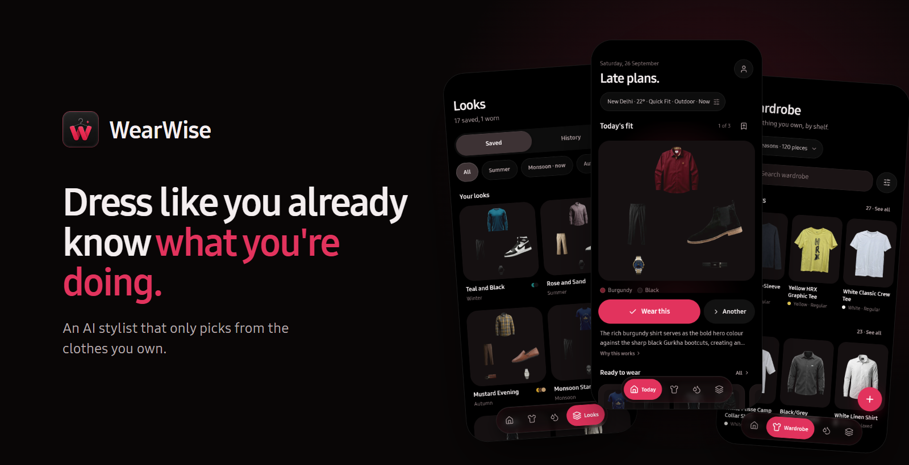
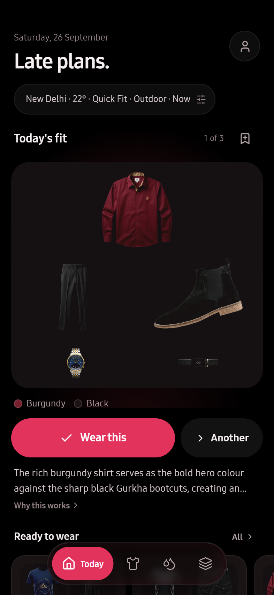
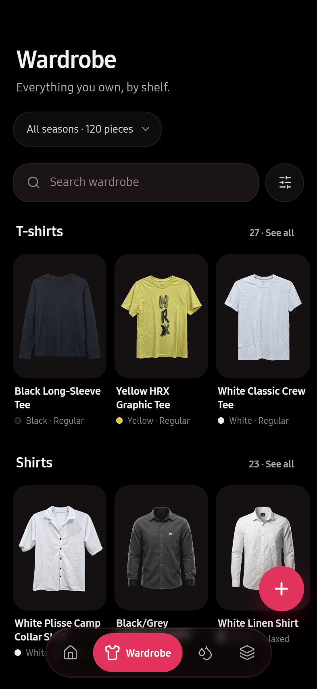
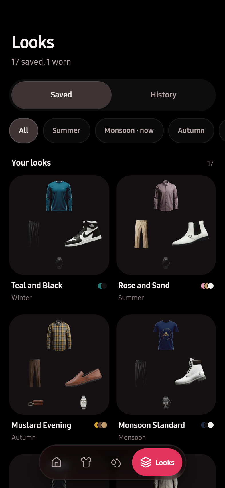
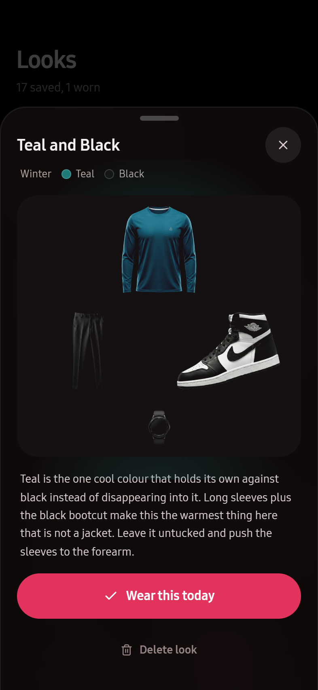
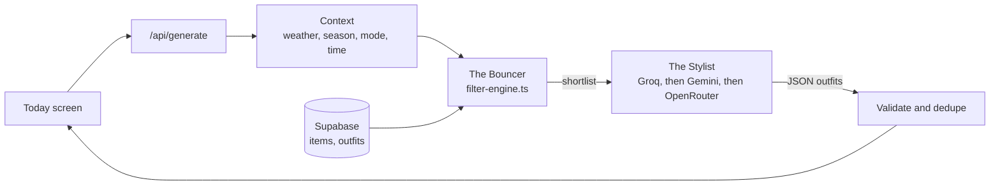

<p align="center">
  
</p>

<p align="center">
  <strong>An AI stylist that only picks from the clothes you actually own.</strong><br>
  Open it in the morning and it has already chosen today's outfit, for today's weather and today's plans.
</p>

<p align="center">
  <a href="#features">Features</a>
  &nbsp;·&nbsp;
  <a href="#how-it-works">How it works</a>
  &nbsp;·&nbsp;
  <a href="#run-it-locally">Run it locally</a>
  &nbsp;·&nbsp;
  <a href="https://github.com/TheAlgo7/wearwise-go-by-algothrim">WearWise Go</a>
</p>

<p align="center">
  
  
  
  
</p>

## Why WearWise

Most AI fashion apps are built for an average user who does not exist. WearWise was built for one real person standing in front of one real wardrobe at 7 AM, who needs an answer, not a mood board.

That constraint shapes everything. It only suggests clothes he owns. It knows the weather in Delhi right now, the season, where he is going and when. It carries his style rules: which fits work on him, which colours he wears, which belts are the favourites. The model is handed a short, relevant list, not a raw wardrobe dump, and asked to decide.

This repository is a public case study in software built around one life instead of a persona. The live app is PIN-locked, because it is somebody's actual wardrobe.

## Screenshots

<table>
  <tr>
    <td align="center"><br><sub>Today's fit, already chosen</sub></td>
    <td align="center"><br><sub>Every piece, by shelf</sub></td>
    <td align="center"><br><sub>Saved looks by season</sub></td>
    <td align="center"><br><sub>Why a look works</sub></td>
  </tr>
</table>

## Features

- **Today decides for you.** Opening the app generates one outfit and shows it as a flat lay. Wear this, or ask for another. The result is cached against its context, so reopening the app does not spend another model call.
- **One context line.** City, temperature, mode, indoor or outdoor, and when. Ten modes cover the week: Quick Fit, Home, Casual, Smart, Gym, Church, Travel, Impress, Night, or describe where you are going.
- **Four Indian seasons.** Summer, monsoon, autumn and winter, picked from live weather or set by hand. Winter unlocks the cold-weather layers; real heat keeps them out.
- **Colour from the clothes.** The app itself stays quiet. Each outfit gets swatches and a soft light in its own colour, spilled around the plate and never onto it.
- **The wardrobe by shelf.** T-shirts, shirts, bottoms, footwear and accessories as rails you can drill into, with search and a season filter.
- **Looks.** Save a combination you like, filter by season, and read why it works.
- **Photo to closet.** Add a photo and the background is cleaned and the piece is tagged by AI: category, colour, formality, vibe and temperature range.
- **A partner view.** A second PIN gives read and suggest access: browse the wardrobe, build a look piece by piece and send it as a pick. Adding, editing and private screens stay with the owner.
- **Care.** Morning and night routines and grooming dates, worked out by a plain rules engine with no model involved, and visible only to the owner.

## How it works


```mermaid
flowchart LR
  today["Today screen"] --> gen["/api/generate"]
  gen --> ctx["Context<br/>weather, season, mode, time"]
  ctx --> bouncer["The Bouncer<br/>filter-engine.ts"]
  db[("Supabase<br/>items, outfits")] --> bouncer
  bouncer -- "shortlist" --> stylist["The Stylist<br/>Groq, then Gemini, then OpenRouter"]
  stylist -- "JSON outfits" --> check["Validate and dedupe"]
  check --> today
```

- **The Bouncer runs in code.** Temperature, formality, vibe, season and recent wear filter the wardrobe before any model sees it. The shortlist is capped so the model sees a focused set, not 120 pieces.
- **The Stylist is the last mile.** The prompt carries the shortlist, the context and a style blueprint with hard rules that always ship. The model returns outfits as JSON, with its reasoning.
- **Nothing the model says is trusted blindly.** Every returned id must exist in the shortlist. Layers are deduped (one pair of shoes, one watch), an open shirt over a tee counts as the outer layer, and a missing pair of shoes is filled by rule.
- **A chain, not a single provider.** Groq answers first. When it is rate limited, Gemini takes over on a separate quota, and free OpenRouter models are the last resort, all inside one 48 second deadline.
- **Time is Delhi time.** The server runs in UTC, so anything that depends on the hour goes through the app's timezone, never the server clock.

## Built with

| Layer | Choice |
|---|---|
| App | Next.js 16 App Router, React 19, TypeScript |
| Styling | Tailwind CSS on OKLCH tokens, SamsungOne type, liquid-glass navigation |
| Data | Supabase Postgres and Storage |
| AI | Groq (Llama 3.3 70B), Google Gemini, OpenRouter |
| Weather | OpenWeather current conditions and geocoding |
| Hosting | Vercel, with a daily keep-alive cron for the free database |

## Run it locally

You need Node 20 or newer and a Supabase project.

```bash
git clone https://github.com/TheAlgo7/wearwise-by-algothrim.git
cd wearwise-by-algothrim
npm install
npm run dev
```

Create `.env.local`:

```env
NEXT_PUBLIC_SUPABASE_URL=
NEXT_PUBLIC_SUPABASE_ANON_KEY=
SUPABASE_SERVICE_ROLE_KEY=
OPENWEATHER_API_KEY=
GROQ_API_KEY=
GEMINI_API_KEY=
OPENROUTER_API_KEY=
NEXT_PUBLIC_DEFAULT_CITY=New Delhi,IN
APP_PIN=
PARTNER_PIN=
```

Then run `supabase/schema.sql` and `supabase/seed.sql` in the Supabase SQL editor. Leave both PINs empty and the lock is off.

| Command | What it does |
|---|---|
| `npm run build` | Production build |
| `npm run lint` | ESLint |
| `npm run type-check` | TypeScript, no emit |
| `python scripts/readme-shots.py` | Rebuilds the screenshots in this README from the live app |

## Project structure

```text
src/
  app/            screens: Today, Wardrobe, Looks, Style, Care, Profile, Unlock
  app/api/        generate, items, upload, clean-image, tag-item, looks, wear, weather, care
  components/     outfit composition, shelves, sheets, bottom nav, One UI controls
  lib/            filter engine, prompts, LLM chain, seasons, colour story, weather, care engine
  proxy.ts        the PIN gate and the partner's permissions
supabase/         schema and seed
scripts/          README screenshots
```

## Privacy and security

- The app sits behind a PIN. The session cookie is a hash of role and PIN, so an owner session and a partner session cannot be swapped.
- The partner role is blocked from every write route in the proxy and again inside the routes.
- Care data lives in tables with row-level security on and no public policies. Only the server, behind an owner check, can read them.
- Wardrobe tables are readable with the publishable key, because the clothes are not a secret. If you fork this for other people, tighten those policies first.

## Licence

Copyright © 2026 Gaurav Kumar, [The Algothrim](https://thealgothrim.com). All rights reserved.

The code is public to read and learn from. It is not licensed for reuse.
